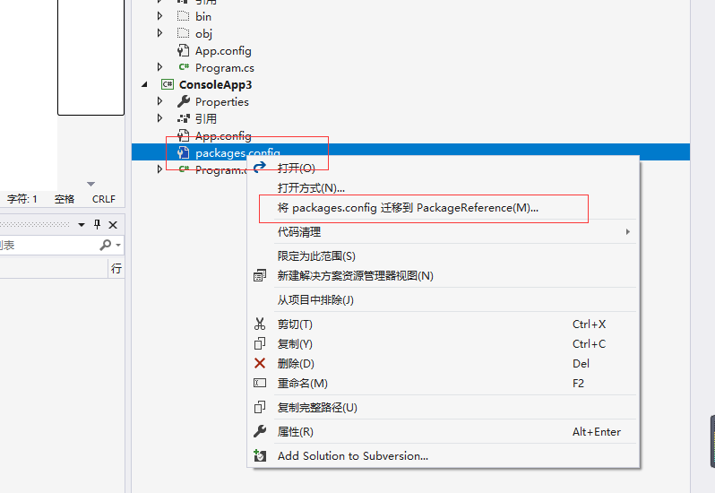

# FreeSql.Provider.SqliteCore

FreeSql.Provider.SqliteCore是`FreeSql`基于微软提供的最新的[`Microsoft.Data.Sqlite.Core`](https://docs.microsoft.com/zh-cn/dotnet/standard/data/sqlite/?tabs=netcore-cli)驱动的实现。
**需要另外安装对应的bundle_xxx**实现加密。

## 支持的版本

- .NET Standard 2.0（支持.NET Framework4.6.1+/支持.NET Core 2.0+）
- net6.0
- SQLite（3.7 及以上版本）
- Linux ARM/X86/MAUI Android/MAUI iOS等

安装`FreeSql.Provider.SqliteCore`包。

```console
dotnet add package FreeSql.Provider.SqliteCore
```

## 不支持加密

0.安装包。

```console
dotnet add package SQLitePCLRaw.bundle_e_sqlite3 
dotnet add package FreeSql.Provider.SqliteCore
```

直接正常使用其他包一样使用FreeSql即可。`SQLitePCLRaw.bundle_e_sqlite3`包不支持加密，但此种方式是官方实现的`SQlite`版本,二选一就行

捆绑 | 描述
---|---
SQLitePCLRaw.bundle_e_sqlite3| 在所有平台上提供一致版本的 `SQLite`。 包括 FTS4、FTS5、JSON1 和 R* 树扩展。 建议使用
SQLitePCLRaw.bundle_e_sqlcipher | 提供 `SQLCipher` 的非官方开放源代码内部版本，**支持加密**。

# FreeSql.Provider.SqliteCore如何加密

那我们不安装 `SQLitePCLRaw.bundle_e_sqlite3`包，换`SQLitePCLRaw.bundle_e_sqlcipher`

## 只有**sqlcipher**才支持加密

0.选择一个目录，创建一个控制台项目`OvOv.FreeSqlMicrosoftSqliteCore`

```console
dotnet new console -n OvOv.FreeSqlMicrosoftSqliteCore
cd OvOv.FreeSqlMicrosoftSqliteCore
```

1.安装包

```bash
dotnet add package SQLitePCLRaw.bundle_e_sqlcipher
dotnet add package FreeSql.Provider.SqliteCore
```

2. 连接串直接指定Password=xxx即可

创建一个类`g.cs`,可直接通过`g.sqlite`访问到`IFreeSql`对象

```cs
public class g
{
    static Lazy<IFreeSql> sqliteLazy = new Lazy<IFreeSql>(() =>
    {
        var fsql = new FreeSql.FreeSqlBuilder()
                .UseConnectionString(FreeSql.DataType.Sqlite, @"Data Source=local.db;Password=123qwe")
                .UseAutoSyncStructure(true)
                .UseLazyLoading(true)
                .UseMonitorCommand(
                    cmd => Trace.WriteLine("\r\n线程" + Thread.CurrentThread.ManagedThreadId + ": " + cmd.CommandText)
                    )
                .Build();
        return fsql;
    }
   );
    public static IFreeSql sqlite => sqliteLazy.Value;
}

```

测试加密,增加一些数据。`Program.cs`中测试

```cs
Test();

static void Test()
{
    IInsert<Topic> insert = g.sqlite.Insert<Topic>();
    var items = new List<Topic>();
    for (var a = 0; a < 10; a++) items.Add(new Topic { Id = a + 1, Title = $"newTitle{a}", Clicks = a * 100 });

    var affrows = insert.AppendData(items).ExecuteAffrows();
    Console.WriteLine("affrows：" + affrows);
    var list = g.sqlite.Select<Topic>().ToList();
    Console.WriteLine("count：" + list.Count);
}


[Table(Name = "tb_topic_insert")]
class Topic
{
    [Column(IsIdentity = true, IsPrimary = true)]
    public int Id { get; set; }
    public int Clicks { get; set; }
    public string Title { get; set; }
    public DateTime CreateTime { get; set; }
}
```

运行项目

```console
dotnet run
```

### 验证是否登录是否加密？

重新运行时，删除 连接串中的Password,发现无法获取数据。或使用`Navicat Premium`工具发现无法连接。

```diff
+ .UseConnectionString(FreeSql.DataType.Sqlite, @"Data Source=local.db;") 
- .UseConnectionString(FreeSql.DataType.Sqlite, @"Data Source=|DataDirectory|local.db;Password=123qwe")
```

提示如下内容，但使用密码时又能正常访问数据。

```txt
SqliteException: SQLite Error 26: 'file is not a database'.
```

相比包 `FreeSql.Provider.Sqlite`来说，目前存在一些限制，

#### |DataDirectory| 默认不支持

需要使用前，指定具体的文件夹，此处相当于指定了当前`dll`所在目录，即`bin/Debug/net6.0`。参考

```cs
string dataSubDirectory = Path.Combine(AppContext.BaseDirectory);

if (!Directory.Exists(dataSubDirectory))
    Directory.CreateDirectory(dataSubDirectory);

AppDomain.CurrentDomain.SetData("DataDirectory", dataSubDirectory);
```

即

```cs
public class g
{
    static Lazy<IFreeSql> sqliteLazy = new Lazy<IFreeSql>(() =>
    {
        string dataSubDirectory = Path.Combine(AppContext.BaseDirectory);

        if (!Directory.Exists(dataSubDirectory))
            Directory.CreateDirectory(dataSubDirectory);

        AppDomain.CurrentDomain.SetData("DataDirectory", dataSubDirectory);

        var fsql = new FreeSql.FreeSqlBuilder()
                .UseConnectionString(FreeSql.DataType.Sqlite, @"Data Source=|DataDirectory|local.db;Password=123qwe")
                .UseAutoSyncStructure(true)
                .UseLazyLoading(true)
                .UseMonitorCommand(
                    cmd => Trace.WriteLine("\r\n线程" + Thread.CurrentThread.ManagedThreadId + ": " + cmd.CommandText)
                    )
                .Build();

        return fsql;
    }
   );
    public static IFreeSql sqlite => sqliteLazy.Value;
}

```

具体的链接串，请参考  [https://docs.microsoft.com/zh-cn/dotnet/standard/data/sqlite/connection-strings](https://docs.microsoft.com/zh-cn/dotnet/standard/data/sqlite/connection-strings)

#### 数学函数

如下函数不支持

- Floor
- Ceiling
- Log10
- Pow
- Sqrt
- Cos

#### TimeSpanTest

测试 类中 不通过、ulong最大值，最小值，超出范围。

- 不支持
  
```cs
  public void Days()
  {
      var data = new List<object>();
      data.Add(select.Where(a => a.CreateTime.TimeOfDay.Days == 0).ToList());
  }
```

- 不支持
  
```cs
 public void Minutes()
  {
      var data = new List<object>();
      data.Add(select.Where(a => a.CreateTime.TimeOfDay.Minutes > 0).ToList());
  }
```

#### 完整代码

- [https://github.com/luoyunchong/dotnetcore-examples/blob/master/Database-Drivers/OvOv.FreeSqlMicrosoftSqliteCore/Program.cs](https://github.com/luoyunchong/dotnetcore-examples/blob/master/Database-Drivers/OvOv.FreeSqlMicrosoftSqliteCore/Program.cs)

## iOS

[https://docs.microsoft.com/zh-cn/dotnet/standard/data/sqlite/xamarin#ios](https://docs.microsoft.com/zh-cn/dotnet/standard/data/sqlite/xamarin#ios)

`Microsoft.Data.Sqlite` 尝试自动初始化 `SQLitePCLRaw` 捆绑。 遗憾的是，由于针对 `Xamarin.iOS` 的预先 (AOT) 编译存在限制，因此尝试失败，并出现以下错误。

>需要调用 `SQLitePCL.raw.SetProvider()`。 如果使用的是捆绑包，可以通过调用 `SQLitePCL.Batteries.Init()` 来完成此操作。

若要初始化该绑定，请在使用 `Microsoft.Data.Sqlite` 之前，将以下代码行添加到应用。

```cs
SQLitePCL.Batteries_V2.Init();
```

即在上方定义`FreeSql`单例时，在`new Lazy`内，调用一次即可。

## .NET Framework 支持

- .NETStandard2.0（支持.NET Framework4.6.1+）

有二种方法支持.NET Framework(选择其中一个即可)

### 1.复制.NET Core中的dll

创建一个.NET Core的console项目，然后安装nuget包 `SQLitePCLRaw.bundle_e_sqlcipher`，编译后生成的`bin\Debug\net5.0\runtimes\win-x64\native\e_sqlcipher.dll`
复制到 .net framework 4.8的项目中`bin/Debug/e_sqlcipher.dll`中

### 2.转换项目 **（建议）**

先安装好相关的包,然后右键`packages.config`,选择将`packages.config 迁移到PackageReference中`,弹出的框勾选所有包，确定即可。

```bash
Install-Package SQLitePCLRaw.bundle_e_sqlcipher
Install-Package FreeSql.Provider.SqliteCore
```


